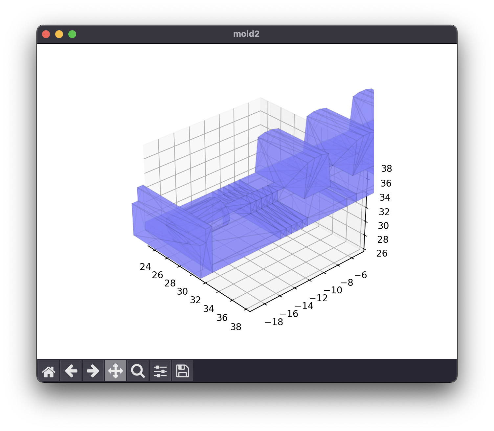
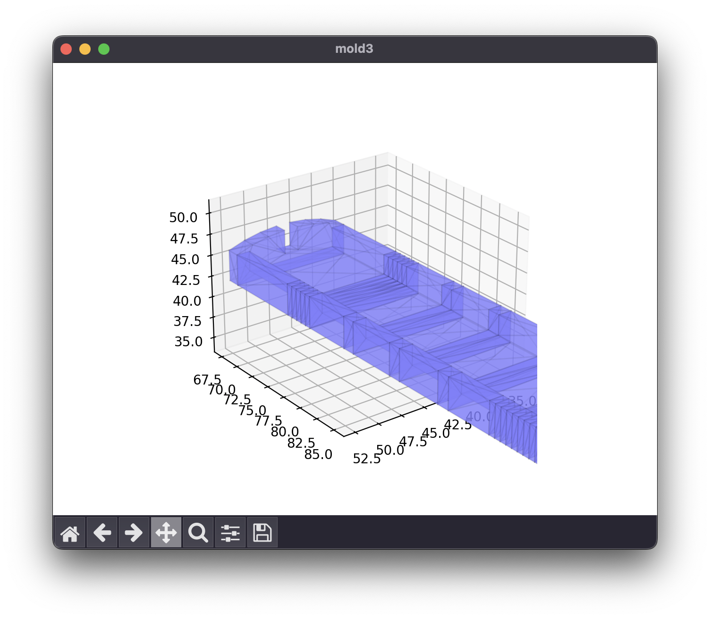

# soft_solution

<div>


</div>

Soft robotic gripper design project for university CAD course, completed in
Fall 2023.

---

<details markdown="1">
  <summary>Table of Contents</summary>

<!-- TOC -->
* [soft_solution](#softsolution)
  * [1 Overview](#1-overview)
  * [2 Design](#2-design)
  * [3 Final Prototype](#3-final-prototype)
  * [4 Setup](#4-setup)
  * [5 Future Improvements](#5-future-improvements)
<!-- TOC -->

</details>

---

## 1 Overview

Soft Solution is a Python script designed to generate STL files for soft robotic
grippers, fingers, and molds for production. It facilitates the rapid creation
of unique, compliant robotic designs by combining smaller CAD segments. This
project was developed as part of the final project for Computer-Aided
Design (MECE3030U) taught by Dr. Aaron Yurkewich, titled "_Soft Robotic
Exoskeleton for Tremor Suppression_".

Example output:

|                      Gripper                       |                         Cavity Mold                          |                       Bottom Seal Mold                       |
|:--------------------------------------------------:|:------------------------------------------------------------:|:------------------------------------------------------------:|
|  |  |  |

The script generates the STL file for the final design, along with three molds:
one for the cuts, one for the cavities and channels, and one for the bottom
seal.

---

## 2 Design

The script operates on the principle that soft robotic pneumatic actuators are
typically composed of repeating patterns of components. Optimizing such actuator
designs often involves modifying these repeating patterns. Remodeling an entire
gripper or finger for simple changes, such as adjusting the thickness of bellow
walls, can be time-consuming and challenging.

This script aims to streamline prototyping and enable the rapid generation of
varied designs for different-sized grippers and fingers, catering to
applications in compliant robotics and exoskeleton development.

---

## 3 Final Prototype

The final prototype consisted of a single gripper, cast
in `Dragon Skin 10 NV Silicone` using a PLA 3D-printed mold, created with the
help of this script and manually controlled using plastic pneumatic tubing and a
syringe.

|                            Mold Top View                             |                        Mold Angled View                        |
|:--------------------------------------------------------------------:|:--------------------------------------------------------------:|
|  |  |

|                                    Stage 1 Mold Cavities                                     |                                    Stage 2 Mold Base Seal                                    |
|:--------------------------------------------------------------------------------------------:|:--------------------------------------------------------------------------------------------:|
|  |  |

|                    Gripper Unpressurized                     |                     Gripper Pressurized                      |
|:------------------------------------------------------------:|:------------------------------------------------------------:|
|  |  |

---

## 4 Setup

Before running any code, ensure all required Python packages are installed using
the command below.

```shell
pip install -r requirements.txt
```

---

## 5 Future Improvements

Potential script improvements identified toward the end of the project:

- Generate STLs from a CSV of finger/gripper dimensions.
- Introduce adjustable pattern components for greater customization.
- Implement spline calculations and graphing to analyze maximum bending and
  expansion.
